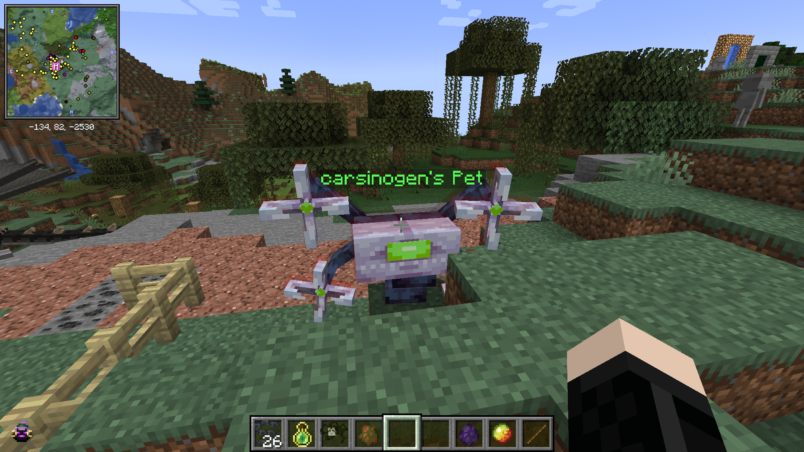
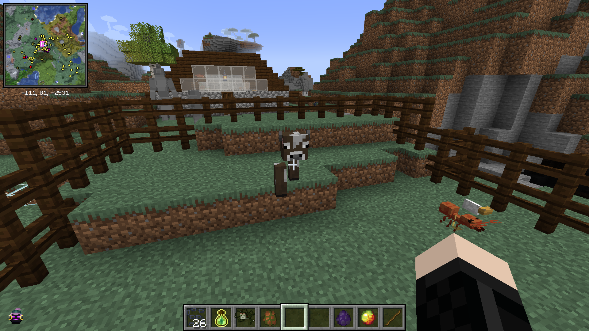

# Catch and Tame Mod

A **Minecraft 1.20.1 Forge** mod that allows you to capture, carry, and adopt nearly any living entity in the game!

## Features

This mod introduces two powerful new items:

### 🎒 The Carry Ball
A utility device that lets you instantly capture an entity with a simple right-click.
* **Mob Transport:** Easily move villagers, farm animals, hostile mobs, and even rare entities across the world.
* **NBT Preservation:** All NBT data (inventories, variants, health, name tags, traits) is perfectly preserved exactly as it was when the entity was scooped up.
* **Status Updates:** The tooltip of the ball will display exactly what entity is stored inside. Use the ball again to release it perfectly back into the world!

### 🐾 The Tame Ball
Take taming to the next level! Throw this ball to instantly force-tame an entity, granting it specialized pet AI.
* **Dynamic AI:** Sneak + Right-Click your pet with an empty hand to toggle its behavior between three states:
  * **FOLLOW:** The pet actively follows you everywhere.
  * **WANDER:** The pet roams around the local area freely.
  * **STAY:** The pet freezes exactly where it is.
* **Advanced Teleportation:** If your pet is set to `FOLLOW`, it will instantly teleport to you if it gets too far away. This includes seamlessly warping across entirely different dimensions OR tagging along when you use a minimap or `/tp` command!
* **Bodyguard Protocol:** Your tamed pets will fiercely defend you and strike down enemies that attack you.
* **Persistent Ownership:** Displays a rich visual `[Player Name]'s Pet` tag above the animal.
* **Stray Protection:** You cannot capture, scoop up, or steal a tame ball, cat, dog, or horse that already belongs to another player.

### 🧬 The Mutagenic Breed Stick
Play mad scientist and create unspeakable horrors (or beautiful new species) via procedurally merged genetics!
* **Gene Splicing:** Right-click any two entities with the stick to extract their genetic material. Once you collect two samples, a highly chaotic **Mutant** is unleashed.
* **Procedural Chimera Rendering:** Instead of basic model swapping, the mod uses reflection geometry to algorithmically slice and seamlessly weave the 3D meshes of both parents directly on top of each other at runtime based on deterministic random seeds. Half their limbs disappear to form bizarre biological hybrid anatomy!
* **Shared Entity Architecture:** The fused monstrosity dynamically shares the animations and exact NBT metadata attributes of its original, separate host bodies under a unified moving host entity wrapper.

### Examples of Procedural Chimeras
*Here are some actual creations that players have dynamically synthesized in-game using the Breed Stick!*

## Installation
1. Install [Minecraft Forge 1.20.1 (47.2.0 or higher) / 47.4.10 tested].
2. Drop the `catchandtame-1.0.0.jar` into your Minecraft `mods` folder.
3. Launch the game and enjoy your new companions!
